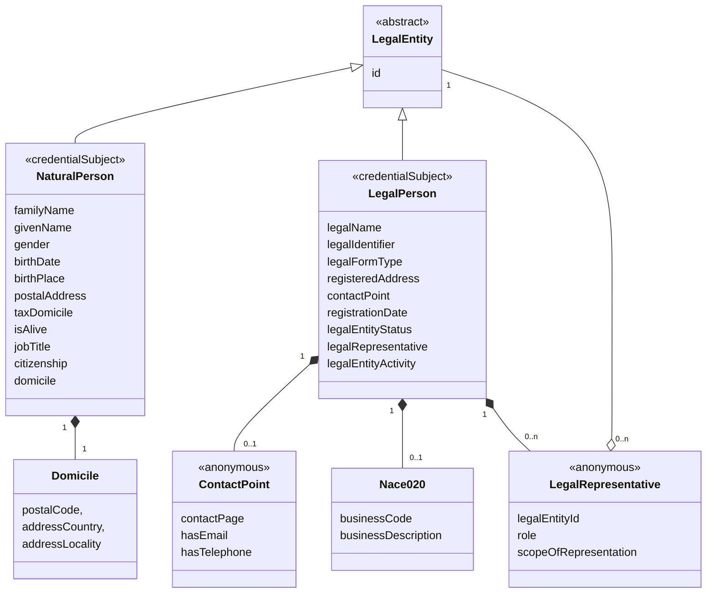

EU Company Vocabulary
=====================

## 1 Abstract

This specification describes an experimental vocabulary for asserting a EU Company Certificate.
Enterprises can use this certificate to prove claims about themselves to business partners.
The EU Company Certificate contains a subject which represents the company as legal person. It holds selected claims about the company including a list of representatives. Representatives are linked to Natural or Legal Persons which are held in separate credentials.

Click here to open the JSON-LD file: [eucc.jsonld](https://oid.spherity.com/contexts/eucc/v1.jsonld)

## 2 Use Case and Requirements

The following vocabulary is intented to be used in cross-border uses cases in Europe. The two first use cases are:

* Opening a bank
* KYC - Risk management in compliance with money laundering act.

The vocabulary represents the set of claims agreed between the partners of the EU Digital Identity Wallet Consortium (EWC).

The vocabulary is reusing the following EU Core Vocabularies:

* [Business Core Vocabulary](https://joinup.ec.europa.eu/collection/semic-support-centre/solution/core-public-organisation-vocabulary)
* [Core Public Organisation Vocabulary](https://joinup.ec.europa.eu/collection/semic-support-centre/solution/e-government-core-vocabularies/core-business-vocabulary)
* [Core Location Vocabulary](https://joinup.ec.europa.eu/collection/semic-support-centre/solution/core-location-vocabulary)

The vocabulary is intended to be used to describe the following subjects:

* LegalPerson: refers to an entity that has legal rights and responsibilities, separate from the individuals who comprise it. Legal persons can include corporations, partnerships, associations, and other organizations recognized by the law.

* NaturalPerson: refers to an individual, a human being who has legal rights and responsibilities. In this document NaturalPerson always refers to a human being acting on behalf of a LegalPerson.

## 3 Examples

The examples presented in this section are Verifiable Credentials implementing the W3C Verifiable Credentials Data Model (VCDM). For brevity, they are shown without proof. W3C Verifiable Credentials can be issued using any of the following proofs:

* LD-Proof
* JOSE
* JOSE + "Selective Disclosure for JWTs"

### 3.1 Legal Person Credential

The following example shows a Legal Person Credential:

```json
{
  "@context": [
    "https://www.w3.org/ns/credentials/v2",
    "https://oid.spherity.com/contexts/eucc/v1"
  ],
  "type": [
    "VerifiableCredential",
    "EuCompanyCertificate"
  ],
  "id": "urn:uuid:f086cced-1153-4540-993b-b4d52ca499c2",
  "validFrom": "2019-12-03T12:19:52Z",
  "validUntil": "2029-12-03T12:19:52Z",
  "issuer": "did:key:z6MkiY62766b1LJkExWMsM3QG4WtX7QpY823dxoYzr9qZvJ3",
  "credentialSubject": {
    "id": "did:key:z6Mki562766b1LJkExWMsM3QG4WtX7QpY823dxoYzr9qZvJ2",
    "type": [
      "LegalPerson"
    ],
    "legalName": {
      "@language": "de",
      "@value": "Flower Power AG"
    },
    "legalIdentifier": "DEPLPOAG.123456789",
    "legalFormType": "Aktiengesellschaft",
    "registeredAddress": {
      "post_code": 10119,
      "post_name": "Berlin",
      "thoroughfare": "Unter den Linden",
      "locator_designator": 33
    },
    "registrationDate": "2024-07-02T09:49:49Z",
    "legalEntityStatus": "Active",
    "legalRepresentative": [
      {
        "legalEntityId": "did:key:z6Mki562766b1LJkExWMsM3QG4WtX7QpY823dxoYzr9qZvJ2", // link to subject of Natural or Legal Person Credential
        "role": "CEO",
        "scopeOfRepresentation": "Alone"
      },
      {
        "legalEntityId": "did:key:z6Mki562766b1LJkExWMsM3QG4WtX7QpY823dxoYzr9qZvJ1", // link to subject of Natural or Legal Person Credential
        "role": "Director",
        "scopeOfRepresentation": "Jointly"
      }
    ],
    "legalEntityActivity": {
      "type": "Nace020",
      "code": "IT",
      "businessDescription": "Tech Int. Trade"
    },
    "contactPoint": {
      "contactPage": "https://flower-power.com"
    }
  }
}
```

This credential is bound to the Legal Person. Therefore, a DID which is under control of the Legal Person is assigned to the term `id` of the credential subject.

### 3.2 Natural Person Credential (NPC)

The following example represents the credential of a Natural Person:

```json
{
  "@context": [
    "https://www.w3.org/ns/credentials/v2",
    "https://oid.spherity.com/contexts/oid/v1.jsonld"
  ],
  "type": [
    "VerifiableCredential",
    "LegalEntityCertificate"
  ],
  "id": "urn:uuid:f086cced-1153-4540-993b-b4d52ca499c2",
  "validFrom": "2019-12-03T12:19:52Z",
  "validUntil": "2029-12-03T12:19:52Z",
  "issuer": "did:key:z6MkiY62766b1LJkExWMsM3QG4WtX7QpY823dxoYzr9qZvJ3",
  "credentialSubject": {
    "id": "did:key:z6Mki562766b1LJkExWMsM3QG4WtX7QpY823dxoYzr9qZvJ2", // unique subject id used
    "type": "NaturalPerson",
    "givenName": "John",
    "familyName": "Doe",
    "gender": "Male",
    "birthDate": "1970-01-01",
    "domicile": {
      "postalCode": "10119",
      "addressCountry": "Germany",
      "addressLocality": "Berlin"
    }
  }
}
```

This particular credential uses key binding to bind the credential to the holder. The holder of this credential is the Natural Person described in the credential subject. Therefore, a DID which is controlled by the Natural Persons is assigned to the term `id` of the credential subject. This enables the Natural Person to present this credential in form of a verifiable credential.

## 4 Information Model


NaturalPerson and LegalPerson are the subjects of credentials - see [Examples](#3-examples).

Please note that the classes LegalRepresentative, ContactPoint and Nace020 are aggregated, i.e. they exist only in the context of LegalPerson. Similarly, Domicile is an aggregated class that only exists in the context of NaturalPerson. LegalEntity has a composition relationship with LegalRepresentative, i.e. the LegalEntity (NaturalPerson or LegalPerson) exists independently of LegalRepresentative.

Further, LegalEntity is an abstract class and can only be instantiated as NaturalPerson or LegalPerson. LegalRepresentative and ContactPoint are anonymous classes. They are instantiated as value of the corresponding property only:
* LegalRepresentative is described as value of LegalPerson.legalRepresentative.
* ContactPoint is described as value of LegalPerson.contactPoint.

The Nace020 class does not represent an anonymous class, as legalEntityActivity may contain other classes describing the business activity, such as WZ2008, in future implementations.

## 5 Classes

This section describes the classes as defined in the information model. Please note that anonymous classes only exist as instantiated values. Therefore, they are described as value in the section of the corresponding property, i.e.:
* LegalRepresentative is described as value of LegalPerson.legalRepresentative. 
* ContactPoint is described as value of LegalPerson.contactPoint. 

### 5.1 LegalEntity

A LegalEntity is either a NaturalPerson (human being) or LegalPerson (organisation, company, ...).

### 5.2 LegalPerson {#LegalPerson}

The Legal Person uniquely identifies a legal person, as defined by the EWC. Please note that the Business Core Vocabulary refers to LegalPerson using the term LegalEntity.

| Key            | Value                                     |
|----------------|-------------------------------------------|
| Term           | LegalPerson                               |
| URL            | https://oid.spherity.com/eucc#LegalPerson |

| Field               | Description                                                                                                         |
|---------------------|---------------------------------------------------------------------------------------------------------------------|
| legalName           | The name under which the Legal Person is legally registered.                                                        |
| legalIdentifier     | The unambiguous structured reference assigned to the Legal Person by the legal authority that registered it.        |
| legalFormType       | The classification of the Legal Person as a member of a particular group in the context of legal registration.      |
| registeredAddress   | The address at which the Legal Person is legally registered.                                                        |
| contactPoint        | Information (e.g. e-mail address, telephone number) of the legal person through which a user can get in touch with. |
| registrationDate    | The date of registration of the legal person at the legal authority.                                                |
| legalEntityStatus   | Information about the viability of the current position of the legal person.                                        |
| legalRepresentative | A natural or legal person who is authorized to represent this legal person alone or jointly.                        |
| legalEntityActivity | The area of work in which the Legal Entity is engaged.                                                              |

### 5.3 NaturalPerson {#NaturalPerson}

A natural person describes a human who may act as a legal entity.

| Key            | Value                                        |
|----------------|----------------------------------------------|
| Term           | NaturalPerson                                |
| URL            | https://oid.spherity.com/eucc#NaturalPerson  |

| Field         | Description                          |
|---------------|--------------------------------------|
| familyName    | Natural person's family name         |
| givenName     | Natural person's given name          |
| gender        | Natural person's specified gender    |
| birthDate     | Natural person's birth date          |
| birthPlace    | Natural person's birth place         |
| postalAddress | Natural person's postal address      |
| taxDomicile   | Natural person's tax domicile        |
| isAlive       | Indicates if natural person is alive |
| jobTitle      | Natural person's job title           |
| citizenship   | Natural person's citizenship         |
| domicile      | Natural person's current domicile    |

### 5.4 Nace020 {#Nace020}

Statistical Classification of Economic Activities in the European Community

| Key            | Value                                 |
|----------------|---------------------------------------|
| Term           | Nace020                               |
| URL            | https://oid.spherity.com/eucc#Nace020 |

| Field                 | Description                                                                   |
|-----------------------|-------------------------------------------------------------------------------|
| businessCode          | Code of the economic activity.                                                |
| businessDescription   | Informational description of the economic activity as classified by NACE.     |

## 6 Properties

### 6.1 Properties of LegalPerson

#### 6.1.1 legalName {#LegalPerson_legalName}

The name under which the Legal Person is legally registered.

| Key            | Value                                  |
|----------------|----------------------------------------|
| Term           | legalName                              |
| URL            | http://www.w3.org/ns/legal#legalName   |
| Expected Value | language-tagged string                 |

#### 6.1.2 legalIdentifier {#LegalPerson_legalIdentifier}

EUID technical structure ([source](https://github.com/EWC-consortium/eudi-wallet-rfcs/blob/main/ewc-rfc005-issue-legal-person-identification-data.md#5103-lpid-schema)):

`<country code><business register code>.<domestic registration number>_<optional validation character>`

Example from Bolagsverket: SEBOLREG.5560678965s

| Key            | Value                                                     |
|----------------|-----------------------------------------------------------|
| Term           | legalIdentifier                                           |
| URL            | https://oid.spherity.com/eucc#LegalPerson_legalIdentifier |
| Expected Value | string                                                    |

#### 6.1.3 legalFormType {#LegalPerson_legalFormType}

The classification of the Legal Person as a member of a particular group in the context of legal registration.

| Key            | Value                                     |
|----------------|-------------------------------------------|
| Term           | legalFormType                             |
| URL            | http://www.w3.org/ns/legal#legalFormType  |
| Expected Value | string                                    |

#### 6.1.4 registeredAddress {#LegalPerson_registeredAddress}

The address at which the Legal Person is legally registered.

| Key            | Value                                         |
|----------------|-----------------------------------------------|
| Term           | registeredAddress                             |
| URL            | http://data.europa.eu/m8g/registeredAddress   |

#### 6.1.5 contactPoint {#LegalPerson_contactPoint}

Information (e.g. e-mail address, telephone number) of a legal person through which a user can get in touch with.

| Key            | Value                                                  |
|----------------|--------------------------------------------------------|
| Term           | contactPoint                                           |
| URL            | https://oid.spherity.com/eucc#LegalPerson_contactPoint |
| Expected Value | ContactPoint                                           |

#### ContactPoint

| Field         | Description                                                              |
|---------------|--------------------------------------------------------------------------|
| contactPage   | A web page that could be used to reach out the Contact Point.            |
| hasEmail      | An electronic address through which the Contact Point can be contacted.  |
| hasTelephone  | A telephone number through which the Contact Point can be contacted.     |

##### 6.1.5.1 contactPage {#LegalPerson_contactPoint_contactPage}

A web page that could be used to reach out the Contact Point.

| Key            | Value                                 |
|----------------|---------------------------------------|
| Term           | contactPage                           |
| URL            | http://data.europa.eu/m8g/contactPage |
| Expected Value | string                                |

##### 6.1.5.2 hasEmail {#LegalPerson_contactPoint_hasEmail}

An electronic address through which the Contact Point can be contacted.

| Key            | Value                           |
|----------------|---------------------------------|
| Term           | hasEmail                        |
| URL            | http://data.europa.eu/m8g/email |
| Expected Value | string                          |

##### 6.1.5.3 hasTelephone {#LegalPerson_contactPoint_hasTelephon}

A telephone number through which the Contact Point can be contacted.

| Key            | Value                               |
|----------------|-------------------------------------|
| Term           | hasTelephone                        |
| URL            | http://data.europa.eu/m8g/telephone |
| Expected Value | string                              |

#### 6.1.6 registrationDate {#LegalPerson_registrationDate}

The date of registration of the legal person at the legal authority.

| Key            | Value                                      |
|----------------|--------------------------------------------|
| Term           | registrationDate                           |
| URL            | http://data.europa.eu/m8g/registrationDate |
| Expected Value | https://www.w3.org/2001/XMLSchema#date     |

#### 6.1.7 legalEntityStatus {#LegalPerson_legalEntityStatus}

Information about the viability of the current position of the legal person.

| Key            | Value                                   |
|----------------|-----------------------------------------|
| Term           | legalEntityStatus                       |
| URL            | http://data.europa.eu/m8g/companyStatus |
| Expected Value | string                                  |

#### 6.1.8 legalRepresentative {#LegalPerson_legalRepresentative}

A natural or legal person who is authorized to represent this legal person alone or jointly.

| Key            | Value                                                         |
|----------------|---------------------------------------------------------------|
| Term           | legalRepresentative                                           |
| URL            | https://oid.spherity.com/eucc#LegalPerson_legalRepresentative |
| Expected Value | LegalRepresentative                                           |

LegalRepresentative

| Field                 | Description                                                                              |
|-----------------------|------------------------------------------------------------------------------------------|
| legalEntityId         | Unique id of natural or legal person authorized to represent this legal person.          |
| role                  | The role in which the legal representative is acting when representing the legal person. |
| scopeOfRepresentation | Scope of representation either jointly or alone.                                         |

##### 6.1.8.1 legalEntityId {#legalRepresentative_legalEntityId}

Unique id of natural or legal person authorized to represent this legal person. The id is either a DID allowing th legal presentative to authenticates against a verifier by providing an authentication proof with the credential presentation or a URN allowing to identify the legal representative.

| Key            | Value                                                           |
|----------------|-----------------------------------------------------------------|
| Term           | legalEntityId                                                   |
| URL            | https://oid.spherity.com/eucc#legalRepresentative_legalEntityId |
| Expected Value | DID or URN                                                      |

##### 6.1.8.2 role {#legalRepresentative_role}

The role in which the legal representative is acting when representing the legal person.

| Key            | Value                                                  |
|----------------|--------------------------------------------------------|
| Term           | legalRepresentative                                    |
| URL            | https://oid.spherity.com/eucc#legalRepresentative_role |
| Expected Value | string                                                 |

##### 6.1.8.3 scopeOfRepresentation  {#legalRepresentative_scopeOfRepresentation}

Scope of representation either jointly or alone.

| Key            | Value                                                                   |
|----------------|-------------------------------------------------------------------------|
| Term           | legalRepresentative                                                     |
| URL            | https://oid.spherity.com/eucc#legalRepresentative_scopeOfRepresentation |
| Expected Value | "Jointly" or "Alone"                                                    |

#### 6.1.9 legalEntityActivity {#LegalPerson_legalEntityActivity}

The area of work in which the Legal Entity is engaged.

| Key            | Value                                     |
|----------------|-------------------------------------------|
| Term           | legalEntityActivity                       |
| URL            | http://data.europa.eu/m8g/companyActivity |
| Expected Value | Legal Entity Activity Class, e.g. Nace020 |

### 6.2 Properties of NaturalPerson

#### 6.2.1 familyName {#NaturalPerson_familyName}

Natural person's family name.

| Key  | Value                        |
|------|------------------------------|
| Term | familyName                   |
| URL  | http://schema.org/familyName |

#### 6.2.2 givenName {#NaturalPerson_givenName}

Natural person's given name.

| Key  | Value                       |
|------|-----------------------------|
| Term | givenName                   |
| URL  | http://schema.org/givenName |

#### 6.2.3 gender {#NaturalPerson_gender}

Natural person's specified gender.

| Key  | Value                    |
|------|--------------------------|
| Term | gender                   |
| URL  | http://schema.org/gender |

#### 6.2.4 birthDate {#NaturalPerson_birthDate}

Natural person's birth date.

| Key  | Value                       |
|------|-----------------------------|
| Term | birthDate                   |
| URL  | http://schema.org/birthDate |

#### 6.2.5 jobTitle {#NaturalPerson_jobTitle}

Natural person's job title.

| Key  | Value                      |
|------|----------------------------|
| Term | jobTitle                   |
| URL  | http://schema.org/jobTitle |

#### 6.2.6 birthPlace {#NaturalPerson_birthPlace}

Natural person's birth place.

| Key  | Value                        |
|------|------------------------------|
| Term | birthPlace                   |
| URL  | http://schema.org/birthPlace |

#### 6.2.7 postalAddress {#NaturalPerson_postalAddress}

Natural person's postal address.

| Key  | Value                           |
|------|---------------------------------|
| Term | postalAddress                   |
| URL  | http://schema.org/PostalAddress |

#### 6.2.8 taxDomicile {#NaturalPerson_taxDomicile}

Natural person's tax domicile.

| Key            | Value                                                   |
|----------------|---------------------------------------------------------|
| Term           | taxDomicile                                             |
| URL            | https://oid.spherity.com/eucc#NaturalPerson_taxDomicile |
| Expected Value | http://schema.org/addressCountry                        |

#### 6.2.9 isAlive {#NaturalPerson_isAlive}

Indicates whether the natural person is alive.

| Key            | Value                                               |
|----------------|-----------------------------------------------------|
| Term           | isAlive                                             |
| URL            | https://oid.spherity.com/eucc#NaturalPerson_isAlive |
| Expected Value | http://schema.org/Boolean                           |

#### 6.2.10 citizenship {#NaturalPerson_citizenship}

Natural person's citizenship.

| Key            | Value                                                   |
|----------------|---------------------------------------------------------|
| Term           | citizenship                                             |
| URL            | https://oid.spherity.com/eucc#NaturalPerson_citizenship |
| Expected Value | http://schema.org/addressCountry                        |

#### 6.2.11 domicile {#NaturalPerson_domicile}

Natural person's current domicile.

| Key   | Value                                                |
|-------|------------------------------------------------------|
| Term  | domicile                                             |
| URL   | https://oid.spherity.com/eucc#NaturalPerson_domicile |
| Value | Domicile                                             |

#### Domicile

| Field           | Description                                                                                                 |
|-----------------|-------------------------------------------------------------------------------------------------------------|
| postalCode      | The postal code. For example, 94043.                                                                        |
| addressCountry  | The country. For example, USA. You can also provide the two-letter ISO 3166-1 alpha-2 country code.         |
| addressLocality | The locality in which the street address is, and which is in the region. For example, Mountain View.        |

##### 6.2.11.1 postalCode {#NaturalPerson_domicile_postalCode}

Natural person's domicile postal code.

| Key   | Value                                                            |
|-------|------------------------------------------------------------------|
| Term  | postalCode                                                       |
| URL   | https://schema.org/postalCode                                    |

##### 6.2.11.2 addressLocality {#NaturalPerson_domicile_addressLocality}

Natural person's domicile address.

| Key  | Value                             |
|------|-----------------------------------|
| Term | addressLocality                   |
| URL  | http://schema.org/addressLocality |

##### 6.2.11.3 addressCountry {#NaturalPerson_domicile_addressCountry}

Natural person's domicile country code.

| Key  | Value                                                                |
|------|----------------------------------------------------------------------|
| Term | addressCountry                                                       |
| URL  | http://schema.org/addressCountry                                     |

### 6.3 Properties of Nace020

#### 6.3.1 businessCode {#Nace020_businessCode}

Code of the economic activity.

| Key            | Value                                              |
|----------------|----------------------------------------------------|
| Term           | businessCode                                       |
| URL            | https://oid.spherity.com/eucc#Nace020_businessCode |
| Expected Value | Code                                               |

#### 6.3.2 businessDescription {#Nace020_businessDescription}

Informational description of the economic activity as classified by NACE.

| Key            | Value                                                     |
|----------------|-----------------------------------------------------------|
| Term           | businessDescription                                       |
| URL            | https://oid.spherity.com/eucc#Nace020_businessDescription |
| Expected Value | string                                                    |

## References

* [Verifiable Credentials Data Model v2.0](https://www.w3.org/TR/vc-data-model-2.0). Manu Sporny, Ted Thibodeau Jr, Ivan Herman, Michael B. Jones, Gabe Cohen. 2024
